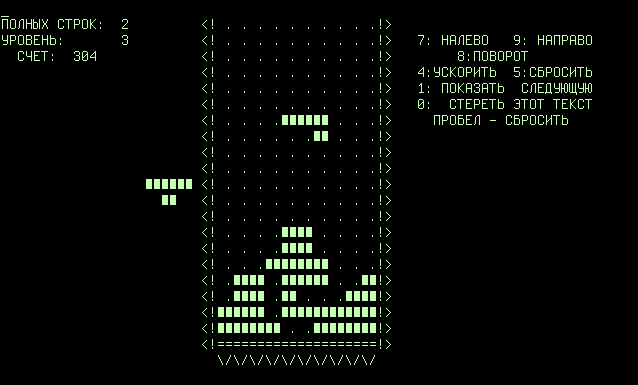
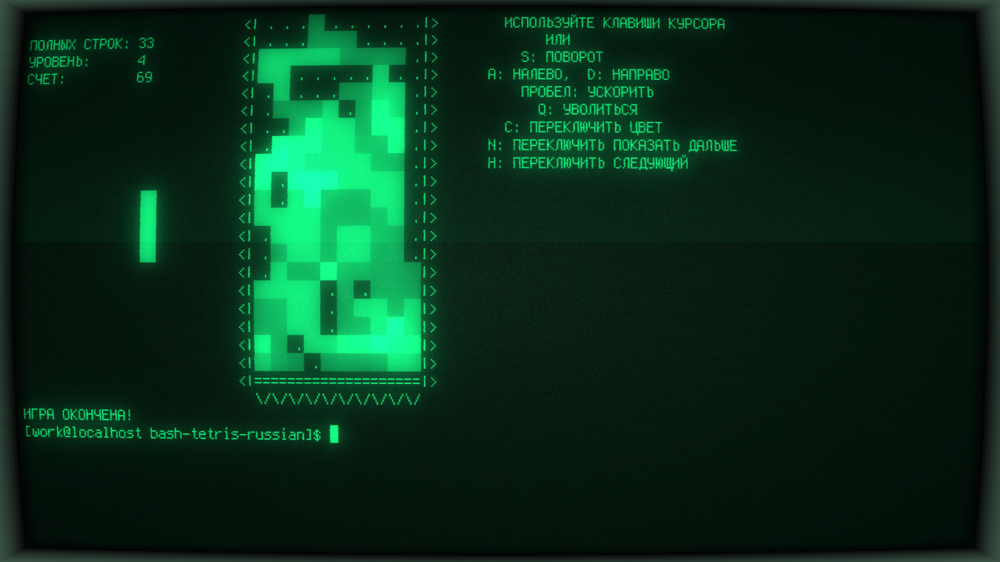

Bash Tetris for Russian Language / Retro
===========

Original Tetris(RU) game implemented in pure bash.

Added Russian Language to this repo: https://github.com/kt97679/tetris


Original Tetris:
&nbsp;



Bash Tetris With Cool-Retro-Term:
&nbsp;



##Usage

Run this for executing in current command line.

```bash
$ ./tetris.sh
```


Run this for executing in Retro Term with background playing [music](music/tetris-theme.mp3).

```bash
$ ./retro.sh
```
